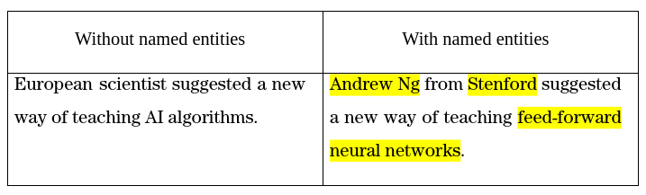

# NER-summarization
## Named entity recognition pretraining for abstractive text summarization

Check-out the paper! https://arxiv.org/abs/2307.02570

This repositiry contains code with demonstarion of MNELM (Masked Named Entity Language Model) pretraining proccedure for the summarization models.

MNEML forces neural network to concentrate more on named entities during its pretraining phase, which helps increase precision and accuracy of named entity inclusion in the generated summaries.

## Features
- **Custom Pretraining Objective:** Enhances model attention on named entities with novel MLNEM learning task.
- **Named Entity Recognition:** Uses RoBERTa for NER.
- **Abstractive Summarization:** Utilizes BART for summarization tasks.
- **Improved Precision and Recall:** Higher named entity inclusion compared to standard masked language models.

### Repository structure

* SCIERC_NER.ipynb - creating and training of RoBERTa NER model on the SCIERC dataset
* bart_pretrain.ipynb - MNELM pretraining of BART model with following summarization fine-tuning
* bart.ipynb - example of working with CNN summarization dataset

